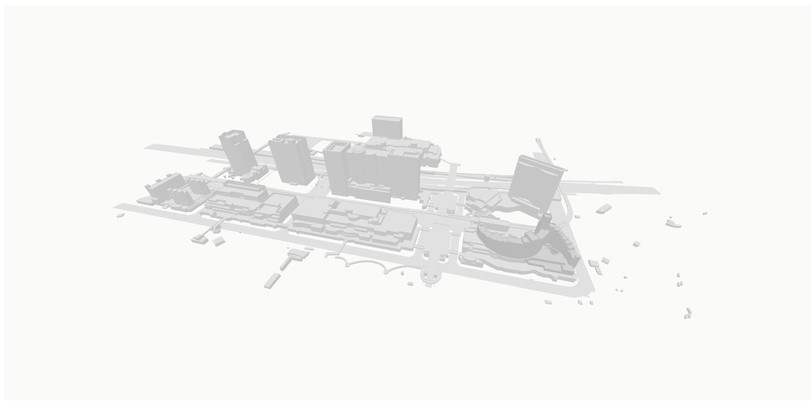
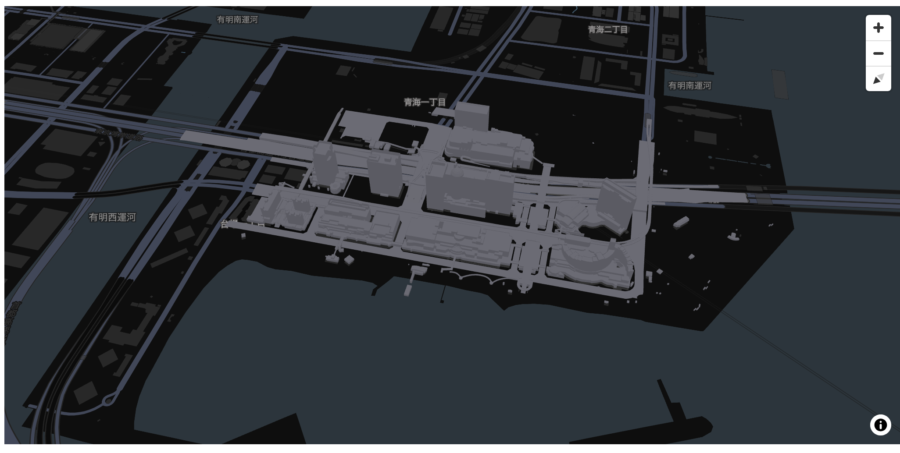

# CityView

[](https://pypi.org/project/cityview/)
[](https://www.npmjs.com/package/three-cityjson)

CityJSON loader and renderer for [Three.js](https://threejs.org/), [React-three-fiber](https://github.com/pmndrs/react-three-fiber), and [Jupyter Notebook / JupyterLab](https://jupyter.org/).

Supports [CityJSON format](https://www.cityjson.org/) and [CityJSONSeq format](https://www.cityjson.org/cityjsonseq/).

## Contents

- [Packages](#packages)
- [Installation](#installation)
- [Usage](#usage)
- [Roadmap](#roadmap)
- [License](#license)

## Packages

|  Package Name  | Description | Registry |
|----------------|-------------|------------|
| [cityview](https://github.com/ozekik/cityview) (top-level package) | Python package | [](https://pypi.org/project/cityview/) |
| [three-cityjson](https://github.com/ozekik/cityview/tree/master/packages/three-cityjson) | JavaScript / TypeScript package | [](https://www.npmjs.com/package/three-cityjson) |

## Installation

```bash
pip install cityview
```

## Usage

### Basic usage

#### VirtualView

```python
import cityview as cv

view = cv.VirtualView(theme="light")

with open("./packages/three-cityjson/public/sample/daiba_sta.city.jsonl", "r") as f:
    data = f.read()

view.layers = [
    cv.CityJSONLayer(data=data, format="cityjsonseq")
]

view.update()

view
```



#### MapView

```python
import cityview as cv

view = cv.MapView(theme="dark")

with open("./packages/three-cityjson/public/sample/daiba_sta.city.jsonl", "r") as f:
    data = f.read()

view.layers = [
    cv.CityJSONLayer(data=data, format="cityjsonseq")
]

view.update()

view
```



### Handling click events

```python
import cityview as cv

view = cv.VirtualView(theme="light")

with open("./packages/three-cityjson/public/sample/daiba_sta.city.jsonl", "r") as f:
    data = f.read()

def handler(change):
    print(change["new"])

view.observe(handler, names="click")

view.layers = [
    cv.CityJSONLayer(data=data, format="cityjsonseq")
]

view.update()

view
```


## Roadmap

- [ ] Online viewer

## License

MIT
